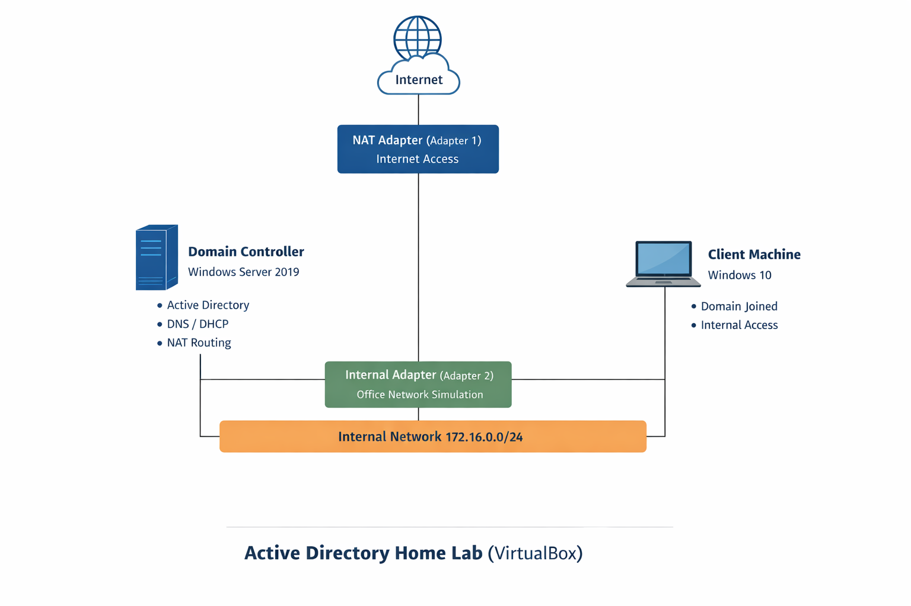

---

## Client Joined to Active Directory Domain

The Windows 10 client machine was successfully joined to the **mydomain.com** Active Directory domain.

Joining the domain allows the client machine to authenticate domain users and receive services such as DNS and DHCP from the Domain Controller.

The system information shows the fully qualified domain name (FQDN) of the machine:

CLIENT1.mydomain.com

This confirms that the client is properly integrated into the domain environment.

---

## Domain User Login and Network Connectivity

This screenshot demonstrates a domain user account successfully logging into the Windows 10 client machine.

On the Domain Controller, user accounts are created and managed through **Active Directory Users and Computers**.

The client machine authenticates the domain user and receives network configuration automatically from the DHCP service running on the Domain Controller.

The command prompt confirms:

- The user is authenticated to the domain (`mydomain\abargo`)
- The client received an IP address from DHCP
- The machine has internet connectivity and can successfully ping external hosts

This verifies that:

- Active Directory authentication is working
- DHCP is assigning network configuration automatically
- The Domain Controller is routing traffic through NAT to the internet

## Network Diagram

